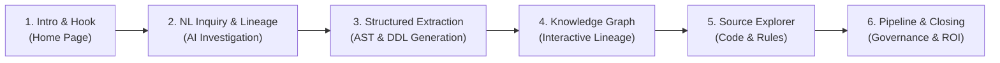

# 🚀 KAIRIX Enterprise Demo Script & Presentation Playbook

**Target Audience:** Enterprise Architects, Modernization Leads, Engineers & Stakeholders  
**Duration:** ~5 to 7 Minutes  
**Application Entry Point:** `http://localhost:8501` (`streamlit run ui/app.py`)  

---

## 📋 Pre-Flight Checklist (Before Starting the Demo)

1. Ensure services are running:
   - **Streamlit App:** `streamlit run ui/app.py` (Active at `http://localhost:8501`)
   - **Neo4j Graph Database:** Port `7687` active
   - **Qdrant Vector Database:** Port `6335` active
2. Open `http://localhost:8501` in your browser in **Full-Screen** or maximized window.
3. Check the **Sidebar** bottom: verify that **Neo4j Graph**, **Qdrant Vector**, and **LLM Provider** show 🟢 green status dots with low latency.

---

## 🎬 Chronological Demo Flow (Step-by-Step)

---

### Step 1: The Hook & Introduction (30–45 seconds)
📍 **Screen:** Home Page — *Investigation Agent*  
🎯 **Goal:** Establish the enterprise problem and introduce KAIRIX as the single source of truth.

* **What to do:**
  * Keep the screen on the **Investigation Agent** home view.
  * Point out the clean Neumorphic enterprise interface and the brand header.
* **What to say:**
  > *"Every enterprise modernization project faces the same fundamental challenge: millions of lines of legacy Mainframe COBOL, undocumented SQL stored procedures, and opaque SSIS ETL pipelines that nobody fully understands.*  
  > *Traditional reverse engineering takes months of manual code reading and still results in missing business logic.*  
  > *Today, I'm excited to show you **KAIRIX** — an AI-powered, deterministic reverse engineering platform that analyzes legacy ecosystems in seconds with 100% line-anchored accuracy."*

---

### Step 2: Natural Language Inquiry & Lineage Investigation (90 seconds)
📍 **Screen:** *Investigation Agent* ➔ **Inquiry & Lineage Investigation** tab  
🎯 **Goal:** Demonstrate multi-pass reasoning, exact math formula extraction, and cross-system lineage.

* **What to do:**
  1. Click one of the quick sample question chips:  
     👉 **`"How is earned premium calculated?"`**  
     *(Or `"Trace the data flow from COBOL rating to KPI reporting."`)*
  2. Click **"Run Investigation"** (or watch the pre-loaded result).
  3. Scroll down through the generated answer card and highlight each section:
     * 📌 **Key Takeaways & Summary:** High-level executive explanation.
     * 📐 **Formula & Calculation:** Exact mathematical formula with inputs, outputs, and prorating logic.
     * 🔄 **Data Flow Lineage:** Step-by-step path (e.g., `EARNPREM.CBL` $\rightarrow$ `Extract_Premium.dtsx` $\rightarrow$ `PolicyCenter_CPP_Breakdown.sql`).
     * 📑 **Line-Anchored Evidence Citations:** Exact file names and line numbers (e.g., `EARNPREM.CBL: Lines 142–165`).
     * 🟢 **Confidence Score:** Highlight the 90%+ confidence and lack of hallucination.
* **What to say:**
  > *"Notice what happened here: KAIRIX didn't just give a generic chatbot response. It performed a hybrid traversal combining Neo4j graph relationships with Qdrant dense vector search.*  
  > *It extracted the exact prorating formula, mapped the end-to-end data flow across COBOL, SSIS, and SQL, and provided verifiable, line-anchored source code citations. Engineers don't have to trust the AI blindly — every claim links directly back to exact source lines."*

---

### Step 3: User-Defined Structured Template Extraction (60–90 seconds)
📍 **Screen:** *Investigation Agent* ➔ **User-Defined Structured Extraction** tab  
🎯 **Goal:** Show deterministic AST parsing that transforms raw legacy code into custom data dictionary schemas.

* **What to do:**
  1. Switch to the **User-Defined Structured Extraction** tab.
  2. Select Technology: **`SQL`** (or `COBOL`).
  3. Under **Step 3 (Define Output Template)**, click one of the quick preset buttons:  
     👉 Click **`| Schema | Database | Table | Columns |`**
  4. Click the primary button: **"Extract Structured Metadata"**.
  5. As the results appear:
     * Show the **Formatted Card Table**: point out the visual database entity badges, schema highlights, and syntax code chips for columns.
     * Type a word in the filter box (e.g., `"claim"` or `"policy"`) to show instant real-time filtering.
     * Click **"⛶ Full Screen"** to show the deep modal view and inspect individual tables.
     * Point out the multi-format export buttons: **CSV**, **Excel (.xlsx)**, **JSON**, **Markdown**, and **SQL DDL**.
* **What to say:**
  > *"Data migration and modernization teams often need structured data dictionaries in specific template formats. With KAIRIX, you can define any custom schema or even upload a CSV/Excel header template.*  
  > *Our deterministic Tree-sitter & SQLGlot AST engines parse the code at the syntax-tree level, generating formatted schema tables and production-ready SQL CREATE TABLE DDLs in under two seconds."*

---

### Step 4: Interactive Knowledge Graph Explorer (60 seconds)
📍 **Screen:** Left Sidebar ➔ Click **"Knowledge Graph"**  
🎯 **Goal:** WOW the audience with interactive visual cross-system graph relationships.

* **What to do:**
  1. Click **"Knowledge Graph"** in the sidebar.
  2. Show the interactive Neo4j Bloom network graph canvas.
  3. Demonstrate controls:
     * **Zoom & Pan:** Scroll to zoom in on clusters; drag to pan.
     * **Scope Filter:** Switch dropdown between **"Full System Graph"**, **"COBOL Mainframe"**, and **"SSIS ETL Pipeline"**.
     * **Node Inspector:** Click any node (e.g., `EARNPREM` or `Extract_Claims`) — show the side panel displaying its properties, degree, connected relationships, and Cypher lineage.
* **What to say:**
  > *"Here is the complete Knowledge Graph. Every COBOL program, copybook, SSIS data flow task, and SQL table is mapped with typed relationships like READS_FROM, WRITES_TO, and TRANSFORMS.*  
  > *Architects can instantly see hidden dependencies and blast radius before making a single code modification."*

---

### Step 5: Source Explorer & Dynamic Registration (45 seconds)
📍 **Screen:** Left Sidebar ➔ Click **"Source Explorer"**  
🎯 **Goal:** Demonstrate enterprise source cataloging and dynamic on-boarding of new code.

* **What to do:**
  1. Click **"Source Explorer"** in the sidebar.
  2. Select a file (e.g., `EARNPREM.CBL` or `ClaimCenter_CPP_Breakdown.sql`).
  3. Show:
     * The syntax-highlighted code viewer with line numbers.
     * Extracted business rules, entities, and calculation sections.
  4. Click the top **"+ Add Source"** button to show how engineers can paste or upload new legacy files to trigger instant automated knowledge extraction.
* **What to say:**
  > *"The Source Explorer serves as the living catalog of your legacy estate. It provides line-by-line syntax inspection, extracted business rules, and lets teams register new legacy artifacts on-the-fly."*

---

### Step 6: Pipeline Governance & Closing (30–45 seconds)
📍 **Screen:** Left Sidebar ➔ Click **"Pipeline"** & point to Sidebar Health  
🎯 **Goal:** Demonstrate enterprise-grade architecture, automated indexing, and wrap up with ROI.

* **What to do:**
  1. Click **"Pipeline"** in the sidebar.
  2. Briefly show the 3 automated layers:
     * Layer 1: Knowledge Engineering Agent (`knowledge_engineering_agent`)
     * Layer 2: Neo4j Graph Ingestion (`graph_layer`)
     * Layer 3: Qdrant Vector Store (`vector_layer`)
  3. Point to the **Sidebar Bottom**: show the live connection indicators (Neo4j, Qdrant, LLM Provider with latency in ms).
* **What to say:**
  > *"Under the hood, KAIRIX is completely modular and governed. The 3-layer pipeline orchestrates deterministic parsing, graph construction, and vector embeddings with real-time health monitoring.*  
  > *In summary: KAIRIX replaces months of high-risk, manual reverse engineering with seconds of deterministic clarity, complete lineage traceability, and 100% auditable evidence.*  
  > *Thank you, and I'd love to take any questions!"*

---

## 🎯 Quick Presentation Summary Table

| Order | Screen / Feature | What to Show | Key Talking Point |
| :---: | :--- | :--- | :--- |
| **1** | **Hero Home** | Neumorphic UI, Brand Header | Modernization problem & manual reverse engineering pain |
| **2** | **Inquiry & Lineage** | Sample Question `"How is earned premium calculated?"` | Evidence-backed answer, formula card, cross-system lineage & citations |
| **3** | **Structured Extraction** | Preset template `| Schema | Database | Table | Columns |` | Deterministic AST parsing, formatted card table & DDL export |
| **4** | **Knowledge Graph** | Full System Graph, Zoom/Pan, Node Inspector | Visual cross-system dependencies, blast radius & Cypher relationships |
| **5** | **Source Explorer** | Code viewer, Business Rules, `+ Add Source` | Living catalog & dynamic legacy source registration |
| **6** | **Pipeline & Health** | 3 Pipeline Layers, Dark Terminal, Sidebar Latency | Modular architecture, deterministic pipelines, and enterprise ROI |

---

## 💡 Anticipated Questions & Winning Answers

* **Q: Is the AI hallucinating formulas or column names?**  
  * **A:** *No. KAIRIX uses deterministic AST parsers (Tree-sitter and SQLGlot) for structural code extraction, reconciled against multi-pass LLM reasoning. Every formula and lineage step is line-anchored with exact source file line numbers.*
* **Q: Can KAIRIX handle other legacy languages?**  
  * **A:** *Yes. The parser and knowledge engineering architecture is modular and easily extensible to PL/SQL, Java, C#, RPG, and SAS.*
* **Q: Does this run completely on-premise?**  
  * **A:** *Yes. With local Qdrant, local Neo4j, local SentenceTransformers, and enterprise on-prem LLM endpoints (like NVIDIA NIM or vLLM), zero proprietary code ever leaves your perimeter.*
